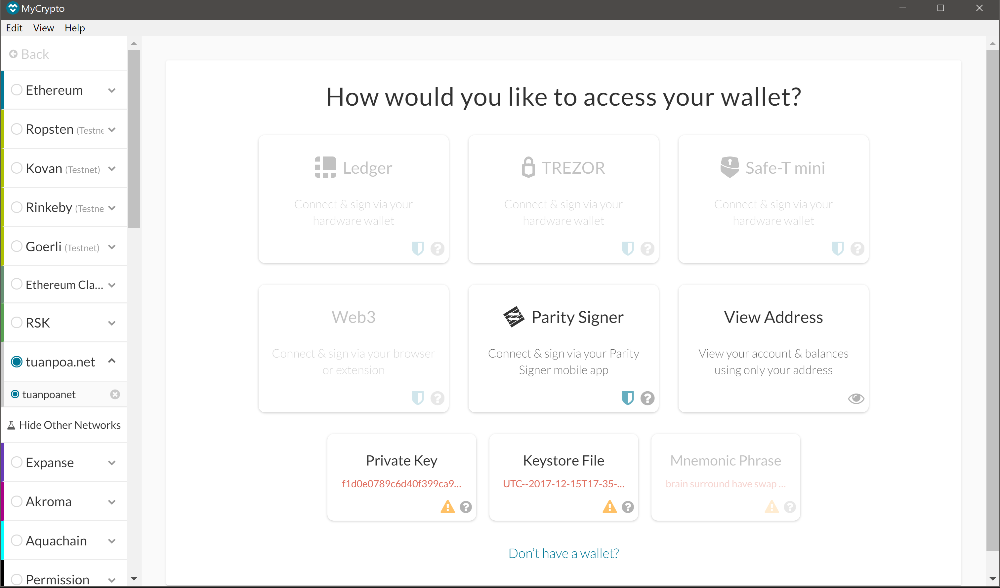

### Dependencies
PHP must be installed on operating system (any version, 5 or 7). No need to know any PHP

1. Clone the hd-wallet-derive tool:
    - Run Git Bash as Administrator 
    - git clone https://github.com/dan-da/hd-wallet-derive
    - cd hd-wallet-derive
    - curl https://getcomposer.org/installer -o installer.php
    - php installer.php
    - php composer.phar install

2. bit Python Bitcoin library:
    - $ pip install bit

3. web3.py Python Ethereum library:
    - $ pip install web3

### Wallet Description:

The derived wallet support for BTC-TEST and ETH and can hold several addess for each coin type. This wallet can be extened to support more coin types if needed 

### Bitcoin testnet faucet:

TxID: abd68de84d4c02031a0112d4fcc4a897b33d7a73c188e9518bbc1f259a0aa36c
Address: n3Xj3HRFUJM7RSwC3w5vxjyWZcQqh8k12w
Amount: 0.001

### Local PoA ethereum transaction

1. ETH address and balance added to the tuanpoanet.json: 0x2018B01C5a7ACa7ecf068345a8451D97eF90d4c2

2. Open a BASH Terminal window and navigate to the designated folder directory - POA Development Chain/POA Chain 

3. Initialize the first node using the genesis .json file by running the command: 
    * ./geth --datadir node1 init tuanpoanet/tuanpoanet.json
    * 
    * 

                                                                                                                 
4. Unlock the account and enable mining using the RPC flag by running the command: 
    * ./geth --datadir node1 --unlock "71f9F6B10971ca20b3dFC693D065F206bCEa8Bb9" --mine --rpc --allow-insecure-unlock

5. Open ANOTHER a BASH Terminal window and navigate to the designated folder directory - POA Development Chain/POA Chain
    * 
    * 

6. Initialize the second node using the genesis .json file by running the command in the newly opened Bash Terminal: 
    * ./geth --datadir node2 init tuanpoanet/tuanpoanet.json, 
    
7. unlock the account and enable mining using the first node's enode address as the bootnode flag by running the command:
    * ./geth --datadir node2 --unlock "8A156A9a5F1052F47738E3880001dcAECB8Bf49c" --mine --port 30304 --bootnodes "enode://23d5c767f45840d2a310e4a7ebc762274825b465c8b8bfd864a618f83838aa2ad2bf800f350dd72db7945f51b36f9d6c1c9cf386f3af4e7638c114d6cd1f58e0@127.0.0.1:30303" --ipcdisable --allow-insecure-unlock
    * Note that the first node's enode address will change each time it is re-initalized 

### Sending Test Transaction using MyCrypto

1. MyCrypto GUI wallet used to connect to the first node (node1) that includes the RPC port:
    * 
    

2. Keystore node imported from the node1/keystore directory into MyCrypto (password `password`)
    * 

3. Blockchain successfully created and test transactions sent from the funded ETH account that was added to the puppernet.json to another ETH account:
    * 
    * 
    
4. The ETH pre-funded address 0x71f9F6B10971ca20b3dFC693D065F206bCEa8Bb9 was used to send a transaction to another ETH address under the child account [1] 0xF79E3d7EE2ec72A99A2Bd3a6b4cAFfa0Be185EB0:
    * 

### Sending Test Transaction using Command Line

The ETH pre-funded address 0x71f9F6B10971ca20b3dFC693D065F206bCEa8Bb9 was used to send a transaction to another ETH address under the child account [1] 0xF79E3d7EE2ec72A99A2Bd3a6b4cAFfa0Be185EB0 and the following lines of code can be used to send the transaction outside of MyCrypto:

eth_key = coins[ETH][0]['privkey']
eth_address = coins[ETH][1]['address']
send_tx(ETH, priv_key_to_account(ETH, eth_key),eth_address, 100)

The following are the steps:

   * 
   * 
   